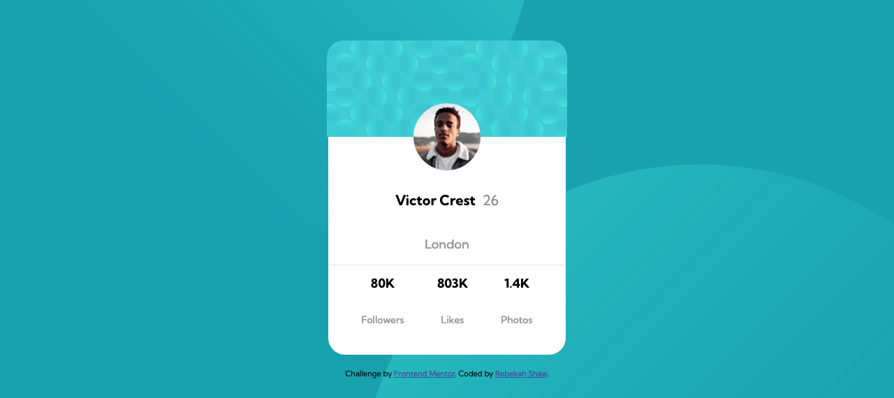
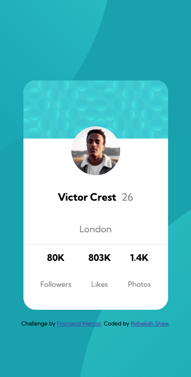

# Frontend Mentor - Profile card component

This is a solution to the [Profile card component challenge on Frontend Mentor](https://www.frontendmentor.io/challenges/profile-card-component-cfArpWshJ). Frontend Mentor challenges help you improve your coding skills by building realistic projects. 

## Table of contents

- [Overview](#overview)
  - [The challenge](#the-challenge)
  - [Screenshot](#screenshot)
  - [Links](#links)
- [My process](#my-process)
  - [Built with](#built-with)
  - [What I learned](#what-i-learned)
  - [Continued development](#continued-development)
  - [Useful resources](#useful-resources)
- [Author](#author)

### The challenge

- Build out the project to the designs provided

### Screenshot

#### Desktop

#### Mobile

### Links

- Solution URL: [Solution](https://github.com/rebekahshaw92/profile-card-component)
- Live Site URL: [Live Site](https://rebekahshaw92.github.io/profile-card-component/)

### Built with

- Semantic HTML5 markup
- CSS custom properties
- Flexbox
- Sass

### What I learned

When undertaking this challenge I was able to learn how to use CSS Flexbox. Normally when creating a project I use Bootstrap which has bult in settings for Flexbox, however this time I chose to use plain HTML and CSS. 

### Continued development

I would like to continue learning flexbox and get used to how it works. 

### Useful resources

- [Felxbox](https://css-tricks.com/snippets/css/a-guide-to-flexbox/) - This helped me to learn the basic about Flexbox. 

## Author

- Website - [Rebekah Shaw](https://www.rebekahshaw.com)
- Frontend Mentor - [@rebekahshaw92](https://www.frontendmentor.io/profile/rebekahshaw92)
- Twitter - [@x_BeckyBoo_x](https://www.twitter.com/x_BeckyBoo_x)

